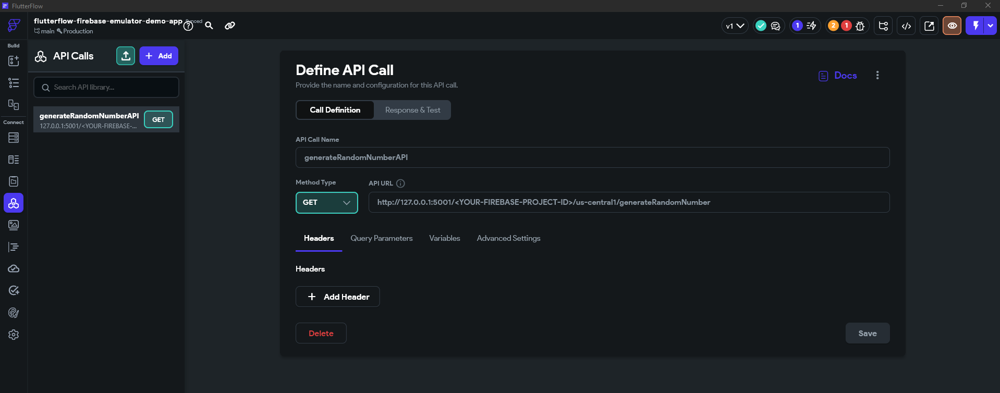

# FlutterFlow Firebase Local Emulator Integration Guide

This guide explains how to set up a FlutterFlow project to work with Firebase Local Emulators for development purposes. This repository provides a pre-configured setup to get you started quickly.

## Repository Structure

This repository offers a preconfigured Firebase project that works with the demo application that is provided below.

```
├── firebase/                # Pre-configured Firebase project
│   ├── functions/           # Cloud Functions
│   │   └── index.js           # Includes "generateRandomNumber" cloud function
│   ├── .firebaserc          # Firebase project configuration
│   ├── firebase.json        # Firebase emulator configuration
│   ├── firestore.rules      # Firestore security rules
│   └── storage.rules        # Storage security rules
│
└── flutterflow/             # FlutterFlow configuration
    └── initFirebaseEmulatorConnector.dart    # Emulator connector code
```

## Prerequisites

- FlutterFlow Desktop Application (Windows/Mac)
- Firebase CLI installed on your computer
- Node.js and npm installed
- Git (for cloning this repository)

## Quick Start

### 1. Clone the Repository

```bash
git clone https://github.com/ZaidShahzad/flutterflow-firebase-emulator-guide.git
cd flutterflow-firebase-emulator-guide
```

### 2. Configure Firebase Project

1. Navigate to the firebase directory
2. Open `.firebaserc` and replace `<YOUR-FIREBASE-PROJECT-ID>` with your firebase project id if you already have a firebase project created. If not, don't worry, we will come back to this later in the guide.

```json
{
  "projects": {
    "default": "<YOUR-FIREBASE-PROJECT-ID>"
  }
}
```

3. Install Functions dependencies:

```bash
cd firebase/functions
npm install
cd ..
```

### 3. Demo Application Setup

This is a demo application that showcases Firebase Emulator integration using the Firebase configuration provided in this github repository.

The demo includes:

- Basic email/password authentication flow
- Firestore usage
- Storage Usage
- Cloud Functions Usage

To set up the demo:

1. Clone the Demo Project in FlutterFlow:

   - Navigate to [\[Demo Project URL\]](https://app.flutterflow.io/project/flutter-flow-with-firebase-emulator-suite-ganrzm)
   - Clone the project
   - (Optional) Rename if you wish

2. Create/Connect a Firebase Project:

   - In your new FlutterFlow project, go to App Settings > Firebase (under Project Setup)
   - If you already have a Firebase project created, type in the project id and Click "Connect"
     - **Important:** The project ID must match what you set in `.firebaserc`
   - If you do not have a Firebase project created, let FlutterFlow create one for you.
     - **Important:** Once created, copy the project ID and put it in `.firebaserc` (by replacing `<YOUR-FIREBASE-PROJECT-ID>` with the project id)

3. Make sure to have all the Firebase Services up and running
   - Authentication
     - Enable Email/Password as sign-in provider
   - Firestore
   - Storage
   - Cloud Functions

### 4. FlutterFlow Configuration - Manual Setup (If you have not cloned the Demo App)

#### 4.1 Create App Constant


1. Navigate to App Values > Constants
2. Click "Add App Constant":
   - Field Name: `connectToFirebaseEmulators`
   - Data Type: `boolean`
   - Value: `true` (ensure checkbox is checked)

#### 4.2 Add Custom Action


1. Navigate to Custom Code
2. Click "add" > "action" and name it `initFirebaseEmulatorConnector`
3. Copy the contents from `flutterflow/initFirebaseEmulatorConnector.dart` into your custom action
4. Configure the action:
   - Return Type: `JSON`
   - Leave "inList" unchecked
   - Leave "nullable" unchecked
   - No arguments required
   - Add "cloud_functions: ^5.1.3" as a pubspec dependency
5. Click "Save"

#### 4.3 Add `initFirebaseEmulatorConnector` as an Initial Action into the main.dart file


1. Navigate to Custom Code > Click main.dart (under Custom Files)
2. Add `initFirebaseEmulatorConnector` under "Initial Actions"
3. Click "Save"

#### 4.4 Create the `generateRandomNumberAPI` as an API call



1. Click "Add" > "Create API Call"
2. Set the API Call Name to `generateRandomNumberAPI`
3. Set the Method Type to `GET`
4. Set the API URL to `http://127.0.0.1:5001/<YOUR-FIREBASE-PROJECT-ID>/us-central1/generateRandomNumber`
   - Replace `<YOUR-FIREBASE-PROJECT-ID>` with your firebase project id.
5. Click "Add Call"

## Now let's test it out!

### 1. Start Firebase Emulators

```bash
# Make sure you're in the flutterflow-firebase-emulator-guide directory before performing the commands below

cd firebase
firebase emulators:start
```

### 2. Run FlutterFlow Application


1. Open FlutterFlow Desktop Application
2. Open your project
3. Run the app using "Local Run" feature

   - If this is your first time using this feature, you will most likely have to do a initial setup. Go through this setup and then follow the directions below.

4. Click "Get Devices"
5. Select a browser as your device (recommended "Chrome" for development) by clicking the green plus button
6. Click "Test"

**Important:** If you're not using the Local Run feature (i.e using FlutterFlow's "Debug/Test Mode"), the custom action will not connect to the emulators.

## Development Workflow

1. Make changes in FlutterFlow
2. Click "Restart App" to see changes
3. Monitor Firebase Emulator UI at `localhost:4000` to track:
   - Authentication state
   - Firestore operations
   - Storage operations
   - Function calls

## Troubleshooting

### Common Setup Issues

#### Firebase Emulator Issues

1. **Emulators Won't Start**

    - Check if ports are already in use
    - Verify you're in the correct directory when running `firebase emulators:start`
    - Try stopping and restarting the emulators
    - Run `firebase emulators:start --project demo-project` if you haven't set project ID

2. **Project ID Related Issues**

    - Double check `.firebaserc` has the correct project ID
    - Ensure project ID in API call URL matches Firebase project
    - Verify project exists in Firebase Console
    - Run `firebase use <project-id>` to set correct project

3. **Function Issues**

   - If functions aren't working:
      ```bash
      cd firebase/functions
      rm -rf node_modules
      npm install
      cd ..
      firebase emulators:start
      ```
   - Verify function logs in Emulator UI for errors
   - Check if function URL matches your project ID

#### FlutterFlow Issues

1. **Local Run Not Working**

      - Ensure FlutterFlow desktop app is up to date
      - Complete the initial Local Run setup process
      - Try using Chrome as the test device
      - Check if Flutter SDK is properly installed

2. **Emulator Connection Fails**

      - Verify `connectToFirebaseEmulators` is set to true
      - Confirm emulators are running before starting the app
      - Check browser console for connection errors
      - Try clearing browser cache and storage

3. **API Call Issues**

      - Verify API URL format:
         ```
         http://127.0.0.1:5001/<YOUR-FIREBASE-PROJECT-ID>/us-central1/generateRandomNumber
         ```
      - Check project ID in URL matches `.firebaserc`
      - Ensure function is deployed to emulator
      - Monitor function logs in Emulator UI

## Contributing

Contributions are welcome! Please feel free to submit pull requests or create issues for improvements.
